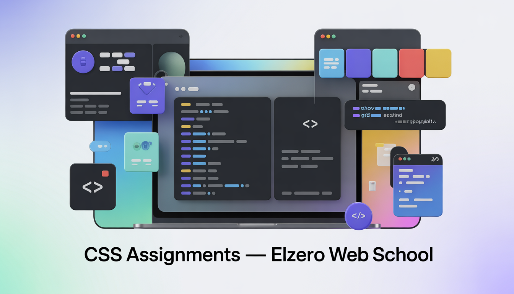

# 🎨 CSS Assignments — Elzero Web School

Welcome to my **CSS journey** 🚀  
This repository contains all my solutions to the **CSS assignments from Elzero Web School**, where I practice transforming plain HTML into **beautiful, responsive, and well-structured designs**.

This repo documents my progress from **CSS fundamentals** to more **advanced layout and styling techniques**.

Whether you’re here to **learn CSS**, **review solutions**, or **get inspiration**, you’re in the right place.

---

## 🎬 YouTube Playlist
Follow the complete CSS course by Elzero Web School on YouTube:  
[**CSS Full Course by Elzero Web School**](https://youtube.com/playlist?list=PLDoPjvoNmBAzjsz06gkzlSrlev53MGIKe)

> Watch the lessons, solve the assignments, and compare your solutions with mine.

---

## 📘 Original Assignments Reference

This repository follows the **official CSS assignments by Elzero Web School**, designed to reinforce each lesson through hands-on practice. The assignments cover selectors, colors, spacing, layouts, Flexbox, Grid, animations, transitions, responsive design, pseudo-classes, pseudo-elements, and modern CSS techniques.

For the **complete and official list of CSS assignments**, visit:  
👉 **https://elzero.org/category/assignments/css-assignments/**

> All assignment instructions and challenges originate from Elzero Web School. This repo contains my personal solutions and implementations.

---

## 📂 Assignment Structure

All assignments are **carefully organized by lesson ranges**, matching the official Elzero curriculum:

- **Lessons 001 → 004** — Elements And Naming
- **Lessons 005 → 008** — Background, Margin, Padding  
- **Lessons 009 → 012** — Border, Outline, Display  
- **Lessons 013 → 016** — Nesting, Dimensions, Overflow
- **Lessons 017 → 021** — Text Formatting
- **Lessons 022 → 026** — Inheritance, Typography
- **Lessons 027 → 029** — Float, Opacity
- **Lessons 030 → 033** — Position, List, Table
- **Lessons 034 → 037** — Pseudo Classes, Pseudo Elements
- **Lessons 038 → 041** — Border Radius, Box Shadow 
- **Lessons 042 → 045** — Transitions, Variables
- **Lessons 046 → 053** — Flex Box
- **Lessons 054 → 056** — Filters, Gradient
- **Lessons 057 → 064** — Grid  
- **Lessons 065 → 067** — Scale, Rotate, Translate
- **Lessons 068 → 073** — Skew, Matrix, 3D Transform
- **Lessons 074 → 077** — Animation
- **Lessons 078 → 082** — Selectors
- **Lessons 083 → 085** — Media Queries
- **Lessons 086 → 088** — Global Values

> Each folder contains **clean, readable, and commented CSS** focused on clarity and best practices.

---

## ✨ Features & Highlights

- 🎯 **Progressive Learning** — From basics to advanced layouts  
- 🧱 **Modern Layouts** — Flexbox & Grid in real examples  
- 📱 **Responsive Design** — Mobile-first mindset  
- 🧼 **Clean Code** — Readable, organized, and maintainable CSS  
- 🧠 **Concept-Focused** — Every assignment targets a specific skill

---

## 🛠️ How to Use

Clone the repository and explore freely:

```bash
git clone https://github.com/0xm3d/CSS-Assignments-from-Elzero-Web-School.git
```

Open any folder, check the HTML + CSS files, and experiment ✨

---

## 📄 License

This project is licensed under the **MIT License**.  
Feel free to use it for learning and reference.

---

## 📫 Contact Me

Let’s connect:

- **GitHub:** [0xm3d](https://github.com/0xm3d)  
- **X (Twitter):** [@0xm3d](https://twitter.com/0xm3d)
